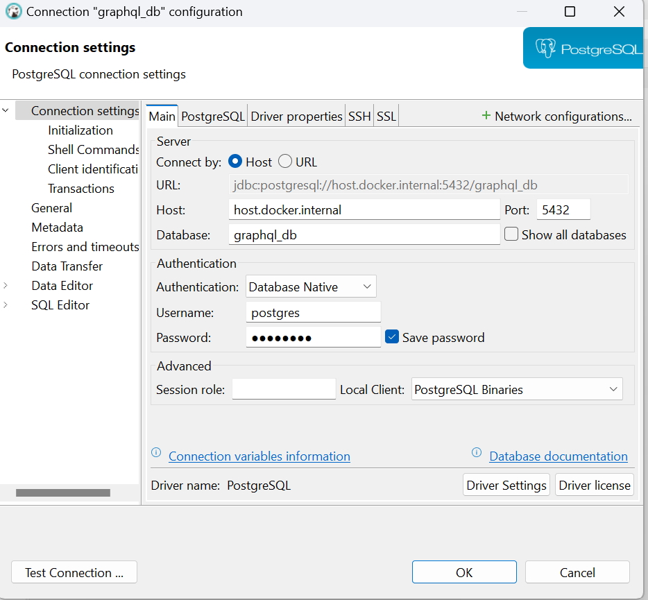

**GraphQL implementation using Python**

Why Use GraphQL?
GraphQL is a flexible and efficient API query language that offers several advantages over REST:

✅ Fetch Exactly What You Need – Clients request specific fields, reducing over-fetching and under-fetching of data.

✅ Single Endpoint – Unlike REST, which requires multiple endpoints, GraphQL consolidates all queries under one endpoint.

✅ Strongly Typed Schema – Ensures predictable responses and better API documentation.

✅ Better Performance – Reduces network requests by allowing batch fetching and nested queries.

✅ Real-Time Data – Supports subscriptions for real-time updates (e.g., WebSockets).

✅ Flexible for Frontend Developers – Clients control the data structure they receive, enabling faster iterations.

Where is GraphQL Used?

Facebook, GitHub, Shopify – For optimizing API performance.
Microservices & BFF (Backend for Frontend) – Aggregates data from multiple services.
Mobile & Web Apps – Reduces the number of API calls, improving performance

This repository demonstrates how to implement graphql using python
In python we have Strawberry, Graphene, and Ariadne libraries for building GraphQL APIs, but they differ in their approaches, flexibility, and ease of use.
Graphene: If you’re working with Django or SQLAlchemy and prefer class-based schemas.
Strawberry: If you like modern Python features like type hints and work with FastAPI.
Ariadne: If you prefer SDL-based schema definition and need Apollo Federation support.

For this project we will use Graphene library
Prerequisite
*********************************
We will use the docker image of PostgreSQL but before that, you should have ​Docker installed on your machine.
1. Install docker desktop
2. Go to stacks directory and run the below command to launch the postgreSQL DB container.
    
   **docker-compose -f postgresql.yml up -d**
3. Install Pgadmin or dbever db cilent to see the seed data (optional)
   
   Refer the postgresql.yml for DB password

