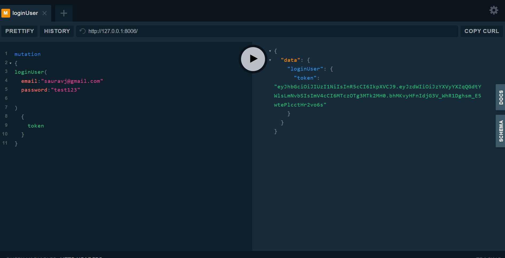
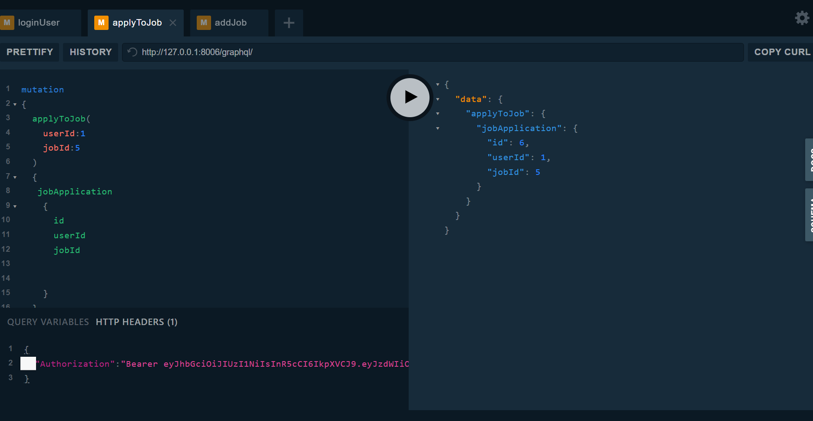

Install python and pycharm or VS code (Ignore if already installed)
Create the virtual environment and install the dependencies
pip install -r requirements.txt

To execute the gql apps
**uvicorn main:app --reload**

Launch the Graphql playgroud
http://127.0.0.1:8000/

Write a mutation to generate a token

pass the generated token in the subsequent mutation

